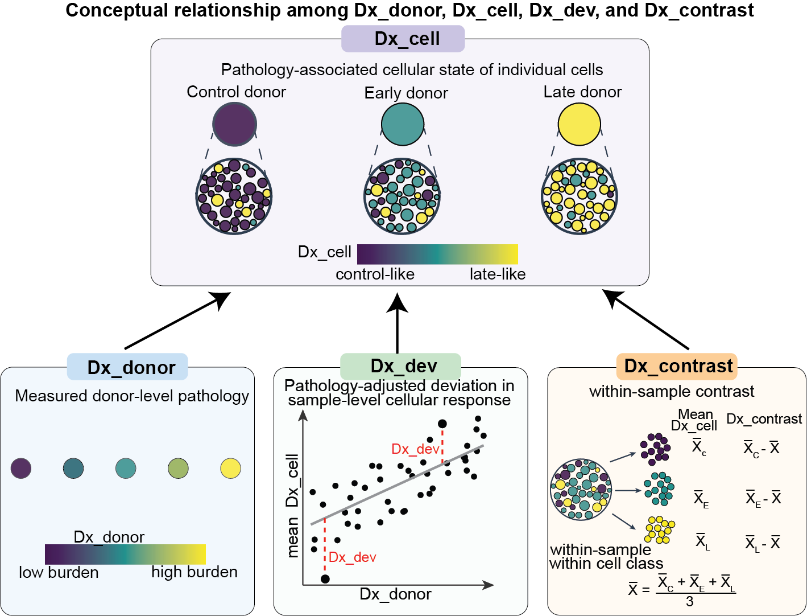

# PsychAD snMultiome

**Analysis code for _Coordinated cellular responses track cognitive outcomes in Alzheimer's disease_**

This repository contains the analysis workflows associated with the PsychAD single-nucleus multiome study. We profiled paired gene expression (snRNA-seq) and chromatin accessibility (snATAC-seq) in approximately **1.42 million nuclei** from **three cortical regions** across **247 donors**, and examined how cellular molecular states relate to Alzheimer's disease (AD) neuropathology and cognitive outcomes.

## Repository organization

```text
PsychAD-snMultiome/
├── 01_taxonomy/    
│   ├── 01_metadata/             # Sample/Donor metadata (Dx_donor)
│   ├── 02_preprocessing/        # ambient RNA correction & doublet removal
│   ├── 03_taxonomy/             # RNA/ATAC cell type annotation
│   ├── 04_spatial_annotation/   # cortical layer annotation
│   └── 05_motif_classify/       # subclass-level TF-binding motif classifer
├── 02_cellular_disease_score/   # Construction, and application of the Dx_cell.
├── 03_Dx_dev/                   # Dx_dev, cell composition and cognitive outcomes  
├── 04_differential_analysis/
│   ├── 01_conventional/         # Conventional pseudobulk differential analyses and variance partitioning
│   ├── 02_Dx_decomposed/.       # `Dx_cell`-state-resolved pseudobulk analyses
│   └── 03_regulon_priorite/     # Integration of TF expression, GRN & TF motif activity
├── 05_donor_axes/.              # Donor transcriptional axes
├── 06_external_validation/.     # Projection, replication and validation analyses in external cohorts and datasets
└── README.md
```

## Conceptual overview of disease-related measurements


<p align="center">
  
</p>

**Figure 1 | Conceptual relationships across analytical scales.** `Dx_donor` summarizes measured neuropathology and is defined independently of the transcriptomic scores. The pathology-supervised `Dx_cell` score positions individual cells along a continuum of disease-associated transcriptional states. At the sample × cell-class level, `Dx_dev` characterizes deviations in average `Dx_cell` after adjustment for `Dx_donor` and other model covariates. In state-resolved pseudobulk analysis, the mean `Dx_cell` of each Dx-decomposed group retains between-sample differences, whereas `Dx_contrast` centers the group-level scores within each sample and cell class. The arrows in the schematic are conceptual; they do not imply that `Dx_donor` is derived from `Dx_cell`.

### Key measurements

| Measurement | Analytical level | Interpretation |
| --- | --- | --- |
| **`Dx_donor`** | Donor / sample pathology | Score summarizing measured AD neuropathological burden; used as supervision for the `Dx_cell` model. |
| **`Dx_cell`** | Individual cell; averaged within pseudobulk groups | RNA-derived, pathology-supervised cellular disease-state score. Group-level averages retain between-sample pathology-associated and pathology-adjusted variation. |
| **`Dx_dev`** | Sample × cell class | Pathology-adjusted deviation in mean `Dx_cell`, estimated using the specified regression model and covariates. |
| **`Dx_contrast`** | Dx-decomposed group within sample × cell class | Group-level mean `Dx_cell` centered relative to the other decomposed groups in the same sample and cell class. |

For a sample and cell class partitioned into control-like, early-like and late-like groups, let $\bar{x}_C$, $\bar{x}_E$ and $\bar{x}_L$ denote their respective group-level mean `Dx_cell` values. The figure illustrates centering by the mean of the three group means:

$$
\bar{x} = \frac{\bar{x}_C + \bar{x}_E + \bar{x}_L}{3},
\qquad
\mathrm{Dx}_{\mathrm{contrast},g} = \bar{x}_g - \bar{x},
\quad g \in \{C,E,L\}.
$$

The group-level mean `Dx_cell` values may still reflect `Dx_donor` and `Dx_dev` effects. Centering removes **additive effects shared across the groups within a sample and cell class**; it does **not** establish that `Dx_contrast` is statistically independent of pathology or `Dx_dev` (for example, the separation among groups may itself change with pathology). The exact group-centering and weighting convention should match the released analysis code and the manuscript Methods.

## Data and model availability

| Resource | Contents | Access / status |
| --- | --- | --- |
| [MSSM PsychAD study on Synapse (syn52160016)](https://www.synapse.org/Synapse:syn52160016) | Raw and processed RNA/ATAC data, associated metadata and complete differential-analysis results | **Data submission in progress.** We expect to place the multiome dataset within the existing MSSM PsychAD study folder. File-level identifiers and any access restrictions will be provided when deposition is complete. |
| [PsychAD snMultiome UCSC Cell Browser](https://cells.ucsc.edu/?ds=psychad-snmultiome) | Interactive exploration of processed single-nucleus data and available annotations | Interactive browser (content and public access should be confirmed before release). |
| [Frozen Dx_cell models on Zenodo](https://zenodo.org/records/23190790) | Frozen model artifacts intended for reuse or projection of `Dx_cell` | Model record (confirm its availability and the specific model files before release). |


<!-- ### Differential expression and chromatin accessibility results 

The **complete DEG and DAC results will be shared through Synapse**, rather than duplicated as large tables in GitHub. Where possible, these files will contain **all tested genes or chromatin features**, not just significant hits, with feature identifiers, the tested comparison and cell population, effect estimates, nominal and adjusted P values, and relevant model and annotation information. -->

## Data, and frozen models

| Resource | Contents | Availability |
|---|---|---|
| [PsychAD study on Synapse (syn52160016)](https://www.synapse.org/Synapse:syn52160016) | Raw and processed multiome data, cell- and sample-level metadata, and intended complete DEG/DAC analysis outputs | **Submission in progress.** This link currently identifies the broader MSSM_PsychAD study folder; file-level accessions and permissions for this dataset should be confirmed after deposition. |
| [UCSC Cell Browser: PsychAD snMultiome](https://cells.ucsc.edu/?ds=psychad-snmultiome) | Interactive visualization of processed single-nucleus data, annotations, and available score fields | Browser link supplied by the study authors. Confirm public visibility and displayed content before release. |
| [Zenodo: frozen Dx_cell models](https://zenodo.org/records/23190790) | Fixed model artifacts for reproducing Dx_cell predictions | Record link supplied by the study authors. **Verify record availability, artifact checksums, and correspondence to the manuscript models** before release. |

## citation
Please cite the following:
```
[TBD]
```
## contact
For questions regarding the analysis code, processed data, or computational methods, please contact:\
Pengfei Dong\
Center for Disease Neurogenomics\
Icahn School of Medicine at Mount Sinai\
Email: pengfei.dong@mssm.edu
